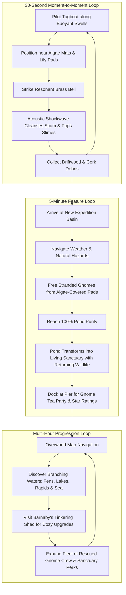

# Game Concept Document: Noble Gnomes — Bramble's Tide & The Garden Sanctuaries

**Status**: Approved Concept  
**Genre**: Cozy Nautical Restoration Simulation / Casual Physics Exploration  
**Platform**: PC (Windows / WebGL)  
**Target Engine**: Three.js / WebGL with URP Stylized Aesthetics  
**Review Mode**: Lean  

---

## 1. Executive Summary & Pitch

> **Elevator Pitch**: Pilot a handcrafted toy tugboat as Captain Bramble across forgotten garden waters, striking a resonant brass bell to soothe troubled algae blooms, rescue stranded gnomes, and restore neglected ponds into thriving, cozy wildlife sanctuaries.

*Noble Gnomes: Bramble's Tide* is an unhurried, tactile, and meditative nautical adventure. It marries the miniature diorama charm of *Captain Toad* and *A Short Hike* with the restorative environmental satisfaction of *Fresh Start Cleaning Simulator* and *Townscaper*.

---

## 2. Creative Vision & Emotional Anchors

- **Core Fantasy**: You are the caretaker of the garden waters. When the ponds grow murky with unruly algae and stranded garden gnomes call out for aid from isolated lily pads, you fire up your little steam boiler, ring your resonant brass bell, and bring music, purity, and life back to the garden.
- **Emotional Resonance**:
  - *Calm & Restoration*: Watching murky olive waters dissolve into sparkling turquoise tranquility as flower buds burst open.
  - *Cozy Fellowship*: Rescuing gnomes who take up charming seats on your aft bench, brew tea in the wheelhouse, and cheer from the restored piers.
  - *Sensory Tactile Joy*: The rhythmic "chug... chug... chug" of the miniature steam chimney, the deep resonant "DING-G-G" of the brass bell, and the pitter-patter of rain on lily pads.

---

## 3. Game Pillars

### Pillar 1: Restorative Tactile Harmony
- **Statement**: Every action in the game feels comforting, physical, and musically satisfying. Ringing the bell emits concentric acoustic ripples that cleanse the pond without combat or violence.
- **Design Heuristic**: When deciding between action-packed combat or soothing acoustic cleansing, choose soothing acoustic cleansing. Slimes are never "killed" or "destroyed"—they are soothed, pop like soap bubbles, or shrink into harmless water sprites.
- **Anti-Pillar**: NOT a frantic twin-stick shooter or survival game. No punishing fail states or game-over timers.

### Pillar 2: Living Weather & Organic Pond Ecology
- **Statement**: Waters are living ecosystems responsive to seasonal weather. Rain showers wash the boat and create dancing ripples, gentle breezes carry leaves and nudge boat drift, sunlight stimulates algae flowers, and frosty mornings form delicate ice sheets that ring like chimes when broken.
- **Design Heuristic**: Weather should feel atmospheric and playful first, tactical second. Weather effects present opportunities for delightful interaction, never tedious micro-management.
- **Anti-Pillar**: NOT a harsh survival climate simulator with freezing death or boat degradation.

### Pillar 3: Living Sanctuaries & Gnome Fellowship
- **Statement**: Cleansing a pond is only the beginning. Restored waters welcome back wildlife—croaking frogs, koi fish, skimming dragonflies, and ducklings—while rescued gnomes settle into bustling lakeside hamlets.
- **Design Heuristic**: Reward player progress with visible life, beauty, and endearing character interactions rather than raw stat inflation.
- **Anti-Pillar**: NOT an empty progression ladder with disembodied UI rewards. Everything is reflected in the 3D world diorama.

---

## 4. The Core Loops

---

## 5. Next Phase Feature Architecture

### Feature Module A: Dynamic Weather & Atmospheric Seasons
| Weather State | Visual Presentation | Gameplay Interaction |
| :--- | :--- | :--- |
| **Spring Showers (Rain)** | Pattering raindrops, soft overcast lighting, dancing ring ripples across water | Automatically washes algae goop from the hull; softens stubborn scum mats; gentle water soundscape. |
| **Golden Sunbeam (Sun)** | Warm golden god rays, sparkling water specular glints, blooming water lilies | High visibility; algae colonies occasionally sprout colorful bloom buds that release bonus salvage debris. |
| **Gentle Zephyr (Wind)** | Swirling autumn leaves, fluttering pennants, water foam streaks | Creates gentle directional water drift; aligning boat heading with wind grants +25% cruising speed. |
| **Crisp Frost (Snow/Ice)** | Delicate snowfall, frosty mist, floating translucent ice floes on pond edges | Boat moves through thin slush; striking the bell shatters ice sheets into musical chiming shards. |

### Feature Module B: Varied Pond Shapes & Biomes
1. **Port Bramble Shallows (Basin)**: Calm, circular garden pond with rustic pier, weeping willows, and floating water lilies.
2. **The Shadow Fens (Labyrinth)**: Winding reed channels with sunken logs, misty dead-ends, and the slumbering Bog Behemoth.
3. **Whispering Lake (Vast Open Waters)**: Expansive open water with rolling gentle swells, wandering algae slicks, and submerged stepping stones.
4. **Misty River Rapids (Current Sluice)**: Linear cascading river with rocky bends, buoyant logs to dodge, and swift forward currents.
5. **The Great Ocean Horizon (Coastal Estuary)**: Boundless ocean vistas with sandy shoals, rolling surf, seagulls, and the ultimate expedition lighthouse.

### Feature Module C: Living Sanctuaries & Returning Wildlife
- Once a pond reaches **100% Purity**:
  - The water clears to vibrant crystalline teal with caustic light refraction.
  - **Sanctuary Fauna** arrives:
    - **Pond Frogs**: Sit on lily pads, occasionally croaking in tune with the tugboat bell.
    - **Koi Fish**: Swim in schools beneath the clear water surface, tracing gentle circular paths.
    - **Dragonflies**: Hover and dart between reeds, leaving micro-ripples on the water.
    - **Ducklings**: Swim in charming family rows, gently bobbing in the boat's wake.
  - Rescued gnomes set up colorful deckchairs and tea tables on the dock.

### Feature Module D: Gnome Crew Roles & Tinkering Upgrades
- **Captain Bramble**: The steady helmsman (steers with hands on wheel).
- **Gimble the Stoker**: Keeps the boiler chugging (provides steady cruising efficiency).
- **Pip the Lookout**: Spots floating debris and hidden gnomes with golden sparkles.
- **Barnaby the Tinkerer**: Upgrades bell harmonics, hull copper-plating, and flower planter boxes on deck.
- **Flora the Botanist**: Cleansed lily pads bloom with rare lotus blossoms that grant bonus salvage seeds.

---

## 6. Verification & Implementation Roadmap

1. **Sprint 1 (Atmosphere & Weather)**:
   - Rain particle system with procedural water ripple emitters.
   - Wind vector system affecting boat drift, chimney smoke tilt, and water streaks.
   - Sunbeam volumetric mist & frost ice floe meshes.
2. **Sprint 2 (Biome Generation & Shape Meshes)**:
   - Parametric pond boundary curves (Channel fens, wide lakes, river sluices).
   - Biome foliage palettes (Autumn deciduous, bog cypresses, alpine pines, coastal palms).
3. **Sprint 3 (Sanctuary Fauna & Audio Polish)**:
   - Low-poly animated pond frogs, swimming koi, and fluttering dragonflies.
   - Dynamic weather audio layers (gentle rain on water, wind through reeds, frog choruses).
